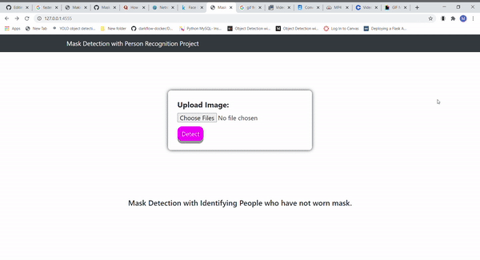
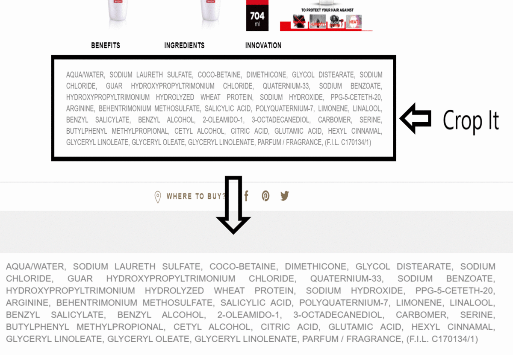
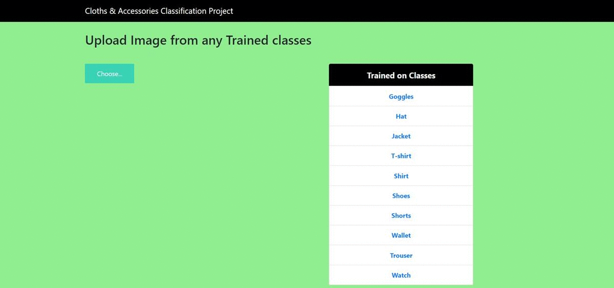
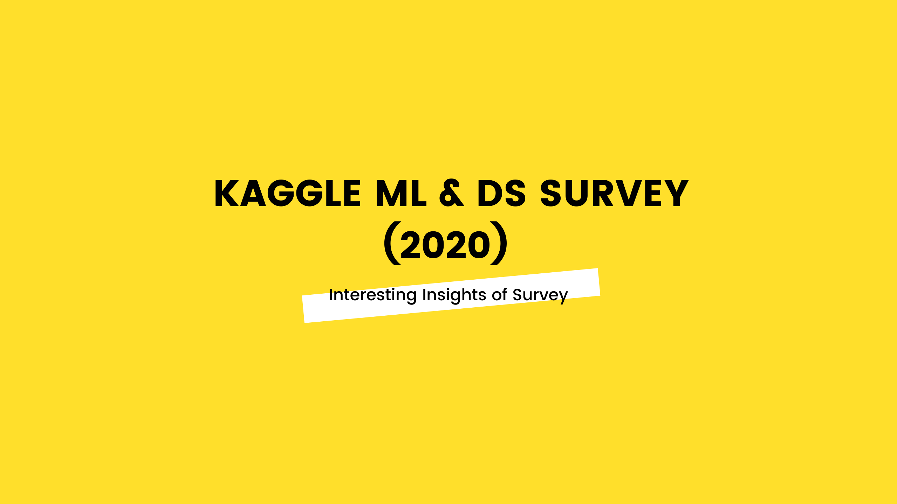

# **Manthan Patel**

**Here are the Projects, Dashboards and Blogs that I have made/written...**

---
# Blogs:
## [**1. TFOD Installation & Object Detection with Pre-Trained Model**](https://inblog.in/TFOD-Installation-Object-Detection-ZEBMHporCF)
* A Blog about How to do installation of TF-1 OD and Object Detection with Pre-Trained TF-1 Model.

## [**2. Building Custom Model using TFOD Pre-Trained Model Weights**](https://inblog.in/Building-Custom-TFOD-Model-g575FfnYE5)
* A Blog about How to Prepare Annotated Dataset & How to train your own custom model for fruit detection using pre-trained model weights.

# **Projects**
---

## [**Project 12: Mask Detection with Person Identification:**](https://github.com/manthanpatel98/Mask_Detection_with_Person_Identification)

* Project is a combination of **Object detection** model and **Image classification** model, to detect person with no mask and identifying that person to store the data in a downloadable csv file with UI.

## [**Project 11: Product Ingredients Label Checker:**](https://github.com/manthanpatel98/Product_Ingredient)

* For the project, I have done a research on most common **harmful** and **natural** ingredients which are used in the Shmapoo.
* The Project is a combination of **OCR** + **Text Scraping** + **Image Scraping** + **Study regarding common harmful & natural Ingredients in Product**

## [**Project 10: Cloths & Accesory Classification:**](https://github.com/manthanpatel98/Cloths-AccessoryClassification)

* This project is built for classifying total 10 different type of cloths and accessories with **VGG** Image Classification Model.

## [**Project 9: 2020 Kaggle Machine Learning & Data Science Survey :**](https://www.kaggle.com/manthan987patel/interesting-insights-of-ml-ds-survey-2020)

* This is Kaggle's annual Machine Learning and Data Science Survey competition for presenting a **story of the data science community**.

## [**Project 8: COVID-19 Detection (X-ray Images):**](https://github.com/manthanpatel98/Covid-19-Detection)
* Dataset of X-ray Images are taken from [**Kaggle**](https://www.kaggle.com/praveengovi/coronahack-chest-xraydataset)
* Here, I have manually chosen images of Covid-19 and Normal State.
* Entire model is trained on total around **400 images**.
* For testing, I have used around **50 images**.
* A Proper **explanation of model** is also given.

### [**Web App on Heroku**](https://covidxraydetection.herokuapp.com/)

## [**Project 7: Data Extraction of Movies/TV Shows:**](https://github.com/manthanpatel98/Web-Scrapping-Movie-Data)

* Here, I have used **bs4** (BeautifulSoup) library for **Extracting Movie/TV Show Data**.
* **MongoDB** is used to store the data in database.
* Information like **'Title'**,**'Time Period'**,**'Rating'**,**'Genre'**,**'Duration'**,**'Votes'**,**'Directors'**,**'Stars'** and **'Description'** are extracted.
* These information are collected for **60,000+ Movies/TV Shows**.
* For more understanding of the project, refer [IMDB-Movies(60000)-Web-Scraping.ipynb](https://github.com/manthanpatel98/Web-Scrapping-Movie-Data/blob/master/IMDB-Movies(60000)-Web-Scrapping.ipynb)

* Finally, I have created [**Data Visualization with PowerBI**](https://github.com/manthanpatel98/Web-Scrapping-Movie-Data) for this data.

---

## [**Project 6: Website Checker**](https://github.com/manthanpatel98/Website-Checker)
* The Dataset has **2453 rows** and **31 columns**.
* It has 31 **columns:**
'having_IP_Address', 'URL_Length', 'Shortining_Service',
 'having_At_Symbol', 'double_slash_redirecting', 'Prefix_Suffix',
       'having_Sub_Domain', 'SSLfinal_State', 'Domain_registeration_length',
       'Favicon', 'port', 'HTTPS_token', 'Request_URL', 'URL_of_Anchor',
       'Links_in_tags', 'SFH', 'Submitting_to_email', 'Abnormal_URL',
       'Redirect', 'on_mouseover', 'RightClick', 'popUpWidnow', 'Iframe',
       'age_of_domain', 'DNSRecord', 'web_traffic', 'Page_Rank',
       'Google_Index', 'Links_pointing_to_page', 'Statistical_report',
       'Result'
* From the Dataset, we have to predict is the website **Phishing** website or not.
* **ExtraTreesClassifier** has been used for Feature Selection.
* I have applied **Artificial Neural Network**, **Random Forest**, **Decision Tree**, **K-NN**, **Naive bayes classification**, **Logistic Regression** and **SVM** algorithms but at the end, **RandomForestClassifier** gave better results.

### **Web App on Heroku:** The Project is no longer available on Heroku

---

## [**Project 5: House Price Prediction (Kaggle)**](https://github.com/manthanpatel98/House-Price-Prediction)
* This is a Kaggle Competition Project.
* **Train** and **Test** Dataset have almost same no. of columns and rows **(1460,81)**.
* Various Techniques like **Target Guided Encoding**, **logarithmic transformation technique**, **StandardScaler**. **Hyperparameter-tuning** etc. have been used.
* Algorithms like **RandomForestRegressor**, **Linear Regression**, **SVR**, **GradientBoostingRegressor** and **ANN** have been applied.

---

## [**Project 4: Restaurant Review Sentiment Analysis**](https://github.com/manthanpatel98/Restaurant-Review-Sentiment-Analysis)
* Dataset has **10000 rows** and **8 columns**.
* We have to predict whether a review is **"Positive"** or **"Negative"**.
* **PortStemmer** method has been used for **Stemming**.
* I have also tried **WordEmbedding** with **LSTM**.
* I have applied many different algorithms **LSTM**, **Bi-Directional LSTM**, **RandomForestClassifier**, **MultinomialNB**, **SVM** and **KNN**.

### [**Web App on Heroku**](https://restaurantreviewsentiment.herokuapp.com/)

---

## [**Project 3: Spam Classifier**](https://github.com/manthanpatel98/SpamClassifier)
* Message and its final output is separated by Tab space.
* From the Dataset, we have to predict the **label** column: 
* **PortStemmer** method has been used for **Stemming**.
* I have applied many different algorithms **RandomForestClassifier**, **MultinomialNB**, **SVM** and **KNN**.

### [**Web App on Heroku**](https://spamclassifiersms.herokuapp.com/)

---

## [**Project 2: Titanic Disaster**](https://github.com/manthanpatel98/Titanic)
* The Dataset has **"PassengerId"**, **"Survived"**, **"Pclass"**, **"Name"**, **"Sex"**, **"Age"**, **"SibSp"**, **"Parch"**, **"Ticket"**, **"Fare"**, **"Cabin"**, **"Embarked"** columns. It has total around **1300 rows** and **12 columns**.
* From the Dataset, we have to predict the **Survived** column: 
* **ExtraTreesClassifier** has been used for **Feature Selection**.
* I have used **Count/Frequency Encoding** Technique for **Feature Encoding**.
* I have applied many different algorithms but at the end, **KNN** gave better results.

### [**Web App on Heroku**](https://titanicdisaster.herokuapp.com/)

---

## [**Project 1: Alcohol Quality Checker**](https://github.com/manthanpatel98/Alcohol-Quality-Checker)
* The Dataset has **'density'**, **'pH'**, **'sulphates'**, **'alcohol'**, **'Quality_Category'** columns. It has **4898 rows** and **5 columns**.
* From the Dataset, we have to predict the **Quality of Alcohol**: **"High"** or **"Low"**.
* **ExtraTreesClassifier** has been used for Feature Selection.
* I have applied **Artificial Neural Network**, **Random Forest**, **Decision Tree**, **K-NN**, **Naive bayes classification** and **SVM** algorithms but at the end, **KNN** gave better results.

### [**Web App on Heroku**](https://alcoholqualitychecker.herokuapp.com/)

---

# **Dashboards**

---
## **Dashboard 1: IMDB Movies/TV Shows Data**

A Data Visualization For Extracted 60,000+ Movies/TV Shows Data.' with **Power BI**.

---
## **Dashboard 2: UFC**
I enjoy watching UFC fights so this was just for fun that I decided to explore UFC fights' Data with **Power BI**.

---

## **Dashboard 3: US Police Violence & Fatalities**
This Dashboard projects violence data in USA with **Tableau**. 

---

## **Dashboard 4: Retail Analysis**
Retail Data Analysis with **Power BI**.
### Number 1: Summary

### Number 2: Detailed

---

## **Dashboard 5: HR-Analytics**
Dashboard is abount Employee and their Satisfaction with their work with **Power BI**.

---

## **Dashboard 6: COVID-19**
This Dashboard was created few months back to understand cases of Covid-19 all over the world with **Tableau**.

---

## **Dashboard 7: Occupation Analysis**
A Dashboard for Occupation Analysis with **Tableau**.

---

## **Dashboard 8: Sales Analysis**
A Dashboard for Sales Analysis with **Tableau**.

---

## **Dashboard 9: Traffic-Deaths**
A Dashboard about Traffic Deaths all over the world with **Tableau**.

---

## **Giving Back To Community**
### [**Instagram Account**](https://www.instagram.com/ds.learn/)

---

## **Contact Information**

**LinkedIn: [linkedin.com/in/manthanpatel987/](https://www.linkedin.com/in/manthanpatel987/)**

---

